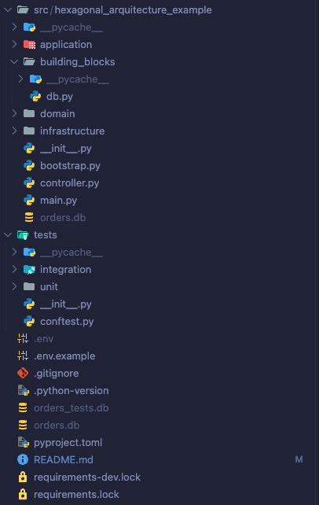

# hexagonal-arquitecture-example

This project was created as an example of how to apply hexagonal architecture

this is for educational purposes only and te code is not production-ready

# Intro

I created a project that uses FastAPI and follows the hexagonal architecuture rules

this project is a simplified app that create a order and get all orders
this project have such funcionalities like:

- Orders
  - Create a order
  - get all orders

# Project structure



# Stack

- Python 3.12.9
- FastAPI
- Sqlite3

# Prerequsites

Make sure you have installed all the following prerequsites on your development machine

- [Python 3.9](https://www.python.org/downloads/)
- [GIT](https://git-scm.com/downloads)
- [RYE](https://rye.astral.sh)

I recommend use rye for install the project dependencies

# Setup

1. Install depedencies

```bash
$ rye sync
```

# Running app localy

1. in the main projects directory create a new `.env` file and copy al the variables from `.env.example`

2. go to `src/hexagonal_arquitecture_example` and run the following command

```bash
$ rye run uvicorn main:app --reload
```

## Tests

go to main project directory and run

```bash
$ 'rye run pytests -v'
```
